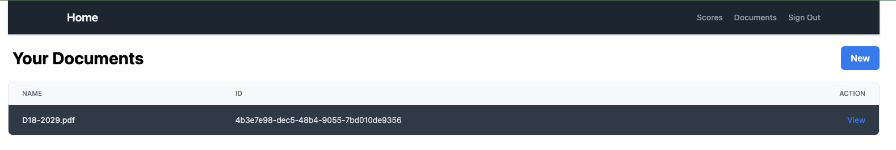
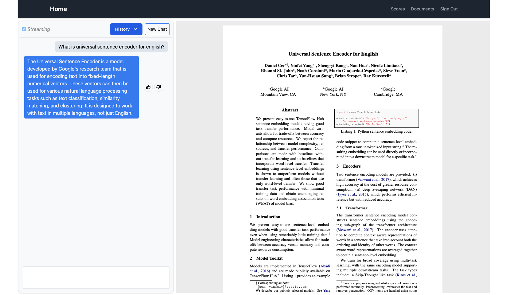
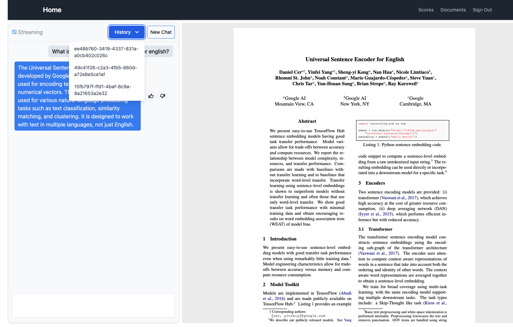
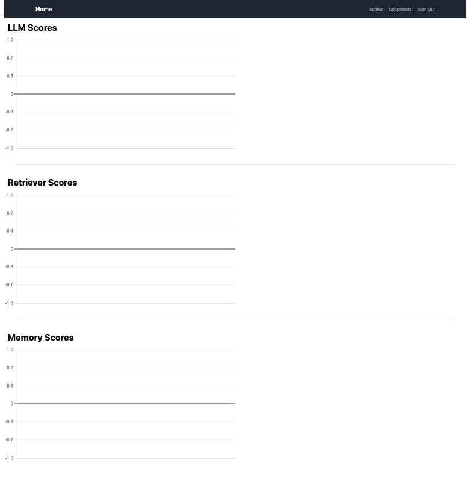

# Langchain PDF Web

Langchain PDF Web is a web-based application that allows users to process and interact with PDF documents using natural language. It leverages LangChain for building AI-powered document interactions.

## Table of Contents
- [Features](#features)
- [Installation](#installation)
  - [Prerequisites](#prerequisites)
  - [Steps](#steps)
- [Usage](#usage)
- [Screenshots](#screenshots)
- [Contributing](#contributing)
- [License](#license)
- [Acknowledgments](#acknowledgments)

## Features
* Upload and process PDF documents
* Perform natural language queries on PDFs
* Integration with LangChain for AI-powered responses
* Web-based interface for ease of use
* Write reusable code using chains provided by LangChain
* Connect chains together in different ways to dramatically change your app's behavior with ease
* Store, retrieve, and summarize chat messages using conversational memory
* Implement semantic search for Retrieval-Augmented Generation using embeddings
* Generate and store embeddings in vector databases like ChromaDB and Pinecone
* Use retrievers to refine, reduce, and rank context documents, teaching ChatGPT new information
* Create agents to automatically accomplish tasks for you using goals you define
* Write tools and plugins to allow ChatGPT to access the outside world
* Maintain a consistent focus on performance through distributed processing using Celery and Redis
* Extend LangChain to implement server-to-browser text streaming
* Improve ChatGPT's output quality through user-generated feedback mechanisms
* Get visibility into how users interact with your text generation features by using tracing

## Installation

### Prerequisites
* Python 3.8+
* Pipenv (optional, for dependency management)
* Redis (if required for caching or task management)

### Steps
1. Clone the repository:

```sh
git clone https://github.com/your-repo/langchain-pdf-web.git
cd langchain-pdf-web
```

2. Install dependencies using `pip`:

```sh
pip install -r requirements.txt
```

**OR** using `pipenv`:

```sh
pipenv install
```

3. Run the application:

```sh
python app/main.py
```

4. Access the web interface at `http://localhost:5000`

## Usage
* Upload a PDF document through the web interface.
* Ask natural language questions about the document.
* Receive AI-generated responses based on the document content.

## Screenshots
Below are some screenshots of the web app:

### Dashboard:



### Chat Page



### Chat History



### Scores




<a id="acknowledgments"></a>
## 

This application was built based on the following tutorial:

**Instructor:** Stephen Grider  
[ChatGPT and LangChain: The Complete Developer's Masterclass](https://www.udemy.com/course/chatgpt-and-langchain-the-complete-developers-masterclass/?srsltid=AfmBOopebU1rQh6-AXZsC6WryOq3uk_SYPN_6quh3aiPWllpVhybwWE5)
